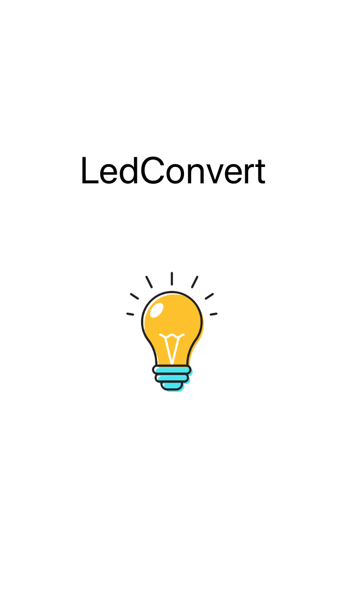
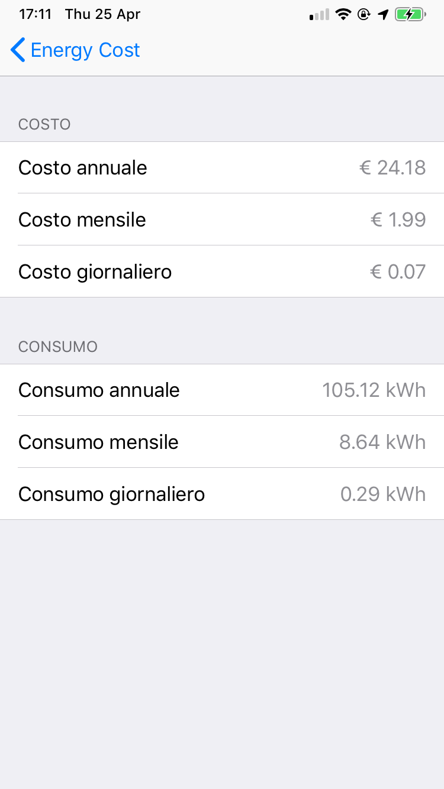
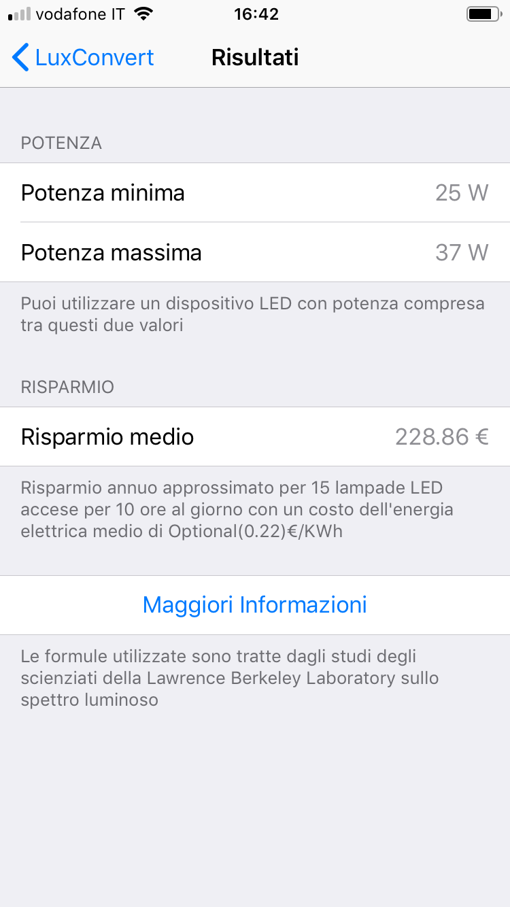

# **LedConvert**

Applicazione che permette di calcolare l'equivalenza, in termini di  luminosità percepita, fra le varie tecnologie e i dispositivi LED. 

Le formule utilizzate sono state tratte dagli [studi degli scienziati della Lawrence Berkeley Laboratory](http://www.esllighting.com.au/pdfs/TheComingRevolutioninLightingPractice.pdf)

  
   
  

